# 메타포켓

### 안드로이드 배포 URL

https://play.google.com/store/apps/details?id=com.metapocket.mobileapp&hl=ko

## UI

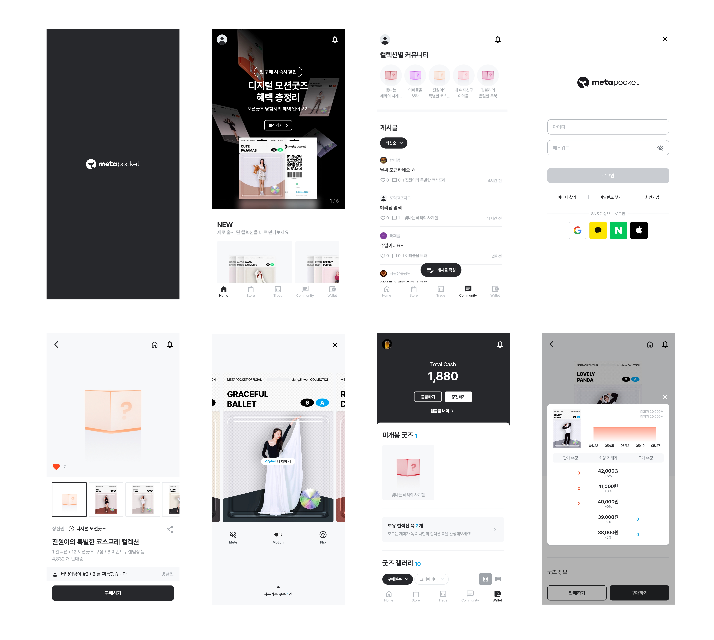

## 페이지 기능

### 1) 홈

|                          홈 페이지                           |                          언어 변경                           |
| :----------------------------------------------------------: | :----------------------------------------------------------: |
| 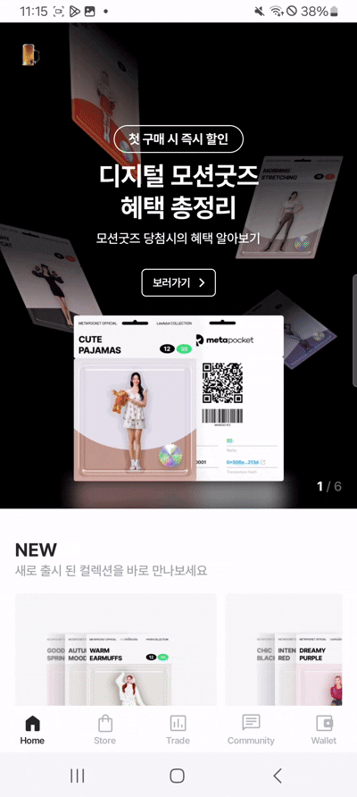 | 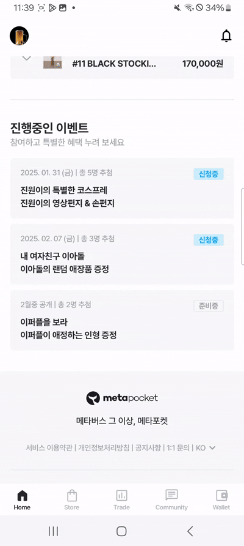 |

## 2) 스토어

|                      스토어 상세 페이지                      |                     스토어 상세 페이지 2                     |                        이벤트 페이지                         |
| :----------------------------------------------------------: | :----------------------------------------------------------: | :----------------------------------------------------------: |
| 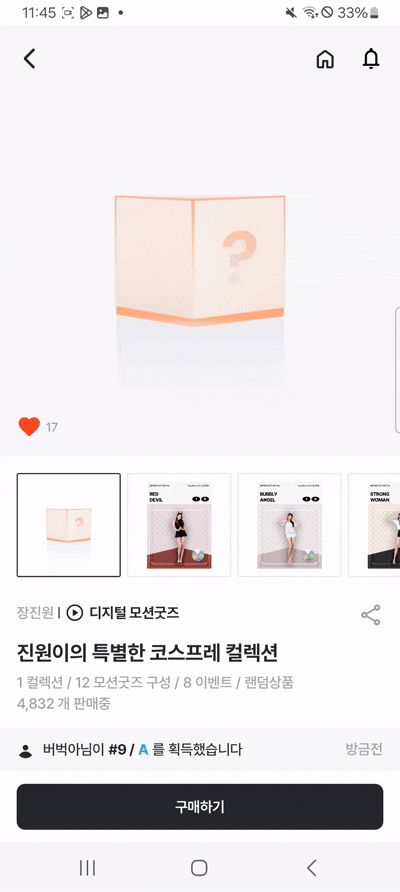 | 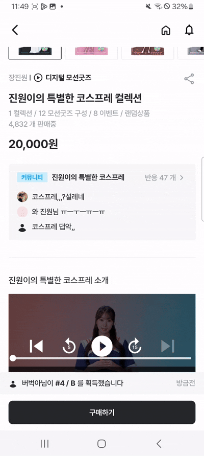 | 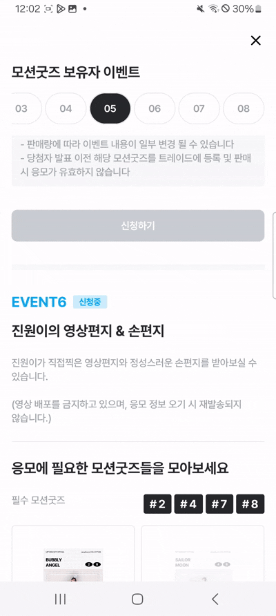 |

## 3) 지갑

|                         지갑 페이지                          |                        갤러리 페이지                         |                          애니메이션                          |
| :----------------------------------------------------------: | :----------------------------------------------------------: | :----------------------------------------------------------: |
| 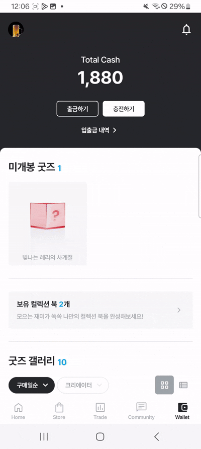 | 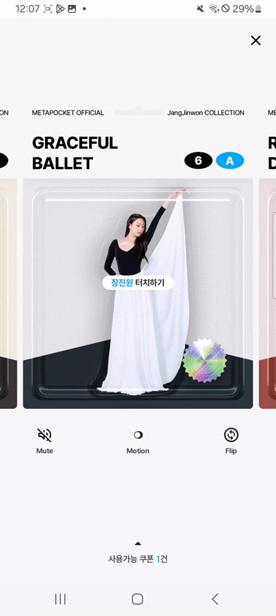 | 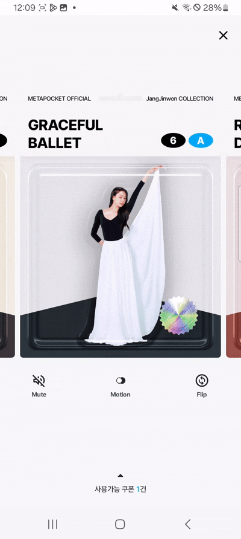 |

## 4) 트레이드

|                     트레이드 상세 페이지                     |                      거래가 비교 (차트)                      |                     판매하기 / 구매하기                      |
| :----------------------------------------------------------: | :----------------------------------------------------------: | :----------------------------------------------------------: |
| 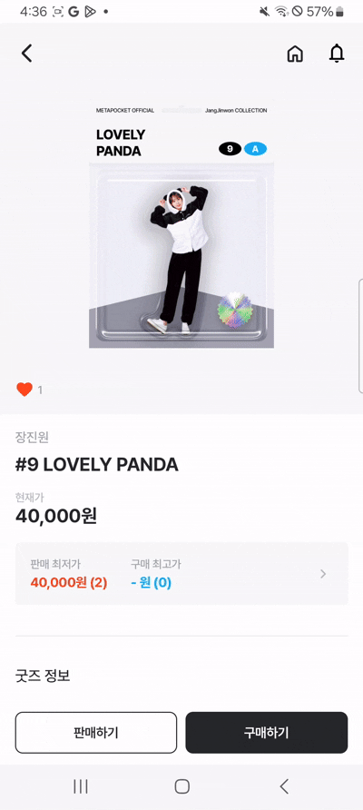 |  | 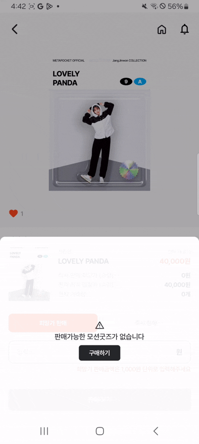 |

## 5) 커뮤니티

|                       커뮤니티 페이지                        |                      게시글 상세 페이지                      |
| :----------------------------------------------------------: | :----------------------------------------------------------: |
| 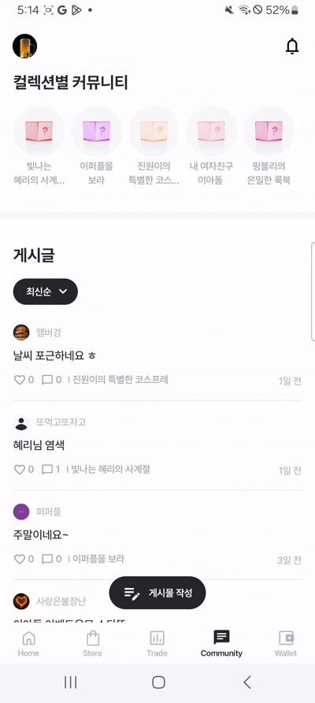 |  |
